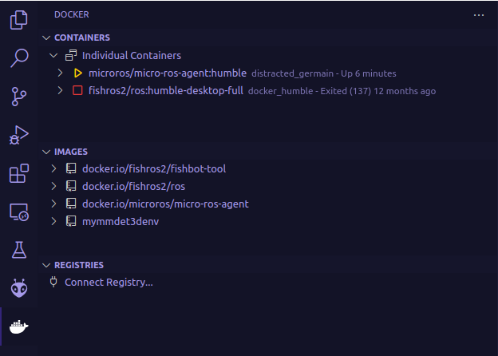

# 添加Micro_ROS
```
lib_deps = 
    https://gitee.com/ohhuo/micro_ros_platformio.git
```
# 打开端口
```
sudo chmod 777 /dev/ttyUSB0
```
# Docker
```
# Serial micro-ROS Agent
sudo docker run -it --rm -v /dev:/dev -v /dev/shm:/dev/shm --privileged --net=host microros/micro-ros-agent:$ROS_DISTRO serial --dev /dev/ttyUSB0 -v6

# TCPv4 micro-ROS Agent
docker run -it --rm -v /dev:/dev -v /dev/shm:/dev/shm --privileged --net=host microros/micro-ros-agent:$ROS_DISTRO tcp4 --port 8888 -v6

# UDPv4 micro-ROS Agent
docker run -it --rm -v /dev:/dev -v /dev/shm:/dev/shm --privileged --net=host microros/micro-ros-agent:$ROS_DISTRO udp4 --port 8888 -v6

# CAN-FD micro-ROS Agent
docker run -it --rm -v /dev:/dev -v /dev/shm:/dev/shm --privileged --net=host microros/micro-ros-agent:$ROS_DISTRO canfd --dev [YOUR CAN INTERFACE] -v6
```

>如何查看ROS 2？
```c
gy@gy-u22:~$ which ros2
/opt/ros/humble/bin/ros2
```
我没有安装*Unable to find image 'microros/micro-ros-agent:humble'*

```c
docker run -it --rm -v /dev:/dev -v /dev/shm:/dev/shm --privileged --net=host microros/micro-ros-agent:$ROS_DISTRO serial --dev /dev/ttyUSB0 -v6
Unable to find image 'microros/micro-ros-agent:humble' locally
docker: Error response from daemon: Get "https://registry-1.docker.io/v2/": context deadline exceeded (Client.Timeout exceeded while awaiting headers).
See 'docker run --help'.
```
**查看Docker**
```c
gy@gy-Y:~$ docker ps -aq | wc -l
2
gy@gy-Y:~$ docker container ls -a
CONTAINER ID   IMAGE                              COMMAND                   CREATED         STATUS                       PORTS     NAMES
6a79546352e3   microros/micro-ros-agent:humble    "/bin/sh /micro-ros_…"   5 minutes ago   Up 5 minutes                           distracted_germain
9bb912ba6a3a   fishros2/ros:humble-desktop-full   "/bin/bash"               12 months ago   Exited (137) 12 months ago             docker_humble
gy@gy-Y:~$ docker images
REPOSITORY                 TAG                   IMAGE ID       CREATED         SIZE
mymmdet3denv               latest                a3cbef8e7918   7 months ago    7.21GB
microros/micro-ros-agent   humble                b88b7a8b049e   16 months ago   428MB
fishros2/fishbot-tool      v1.0.0.20230108       f57d067f488d   23 months ago   4.76GB
fishros2/ros               humble-desktop-full   99e9596df21e   2 years ago     3.91GB
gy@gy-Y:~$ docker rmi mymmdet3denv:latest 
Untagged: mymmdet3denv:latest
Deleted: sha256:a3cbef8e79188c24c2d0c1c85fbeba48cad48681eb90474d1d042ceb6aa82426
```

>**$\color{red}{安装了装面版，错了,}$** *解决方案：修改[/home/gy/.docker/config.json]
```c
{
  "auths": {},
  "credsStore": "desktop",
  "currentContext": "desktop-linux",
  "plugins": {
    "-x-cli-hints": {
      "enabled": "true"
    }
  },
  "features": {
    "hooks": "true"
  }
  # 加上这一句
  "hosts": ["unix:///var/run/docker.sock"]
}
```
>打包镜像
```c
$ docker save -o micro-ros-agent.tar microros/micro-ros-agent:humble
WARNING: Error loading config file: /home/gy/.docker/config.json: : invalid character '"' after object key:value pair
/*加载镜像*/
docker load -i micro-ros-agent.tar
```
# 观察现象
```c
ros2 node info /hello_microros
ros2 topic echo count_topic
ros2 node list
```
