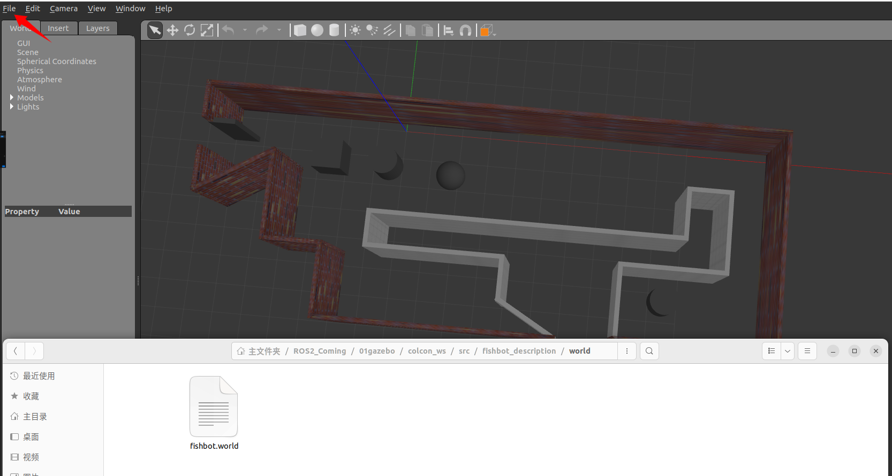

# 仿真环境搭建
## Gazebo的画墙工具
1. Gazebo左上角->Edit->Building Editor
2. 建完后还可以用选Add Color或者Add Texture，然后点击下方墙，给墙添加颜色或者纹理。
3. 将文件保存到我们的fishbot_descrption的world下
4. gazebo --verbose  -s libgazebo_ros_init.so -s  libgazebo_ros_factory.so /home/gy/ROS2_Coming/01gazebo/colcon_ws/src/fishbot_description/world/fishbot.world


## 启动仿真环境--在launch中加载World
1. 添加launch
> /home/gy/ROS2_Coming/01gazebo/colcon_ws/src/fishbot_description/launch/diaplay_Hr.launch.py
```
    gazebo_world_path = os.path.join(pkg_share, 'world/fishbot.world')

    # Start Gazebo server
    start_gazebo_cmd =  ExecuteProcess(
        cmd=['gazebo', '--verbose','-s', 'libgazebo_ros_init.so', '-s', 'libgazebo_ros_factory.so', gazebo_world_path],
        output='screen')
```
2. 最后记得修改setup.py文件，让编译后将world文件拷贝到install目录下
```
(os.path.join('share', package_name, 'world'), glob('world/**')),
```

# 运行
```
colcon build
source install/setup.bash
ros2 launch fishbot_description diaplay_Hr.launch.py 


ros2 run rqt_graph rqt_graph
ros2 run teleop_twist_keyboard teleop_twist_keyboard
```
> 将雷达的Decay Time修改成1000,然后遥控Fishbot在环境中走一圈，然后观察雷达留下的点云形状。