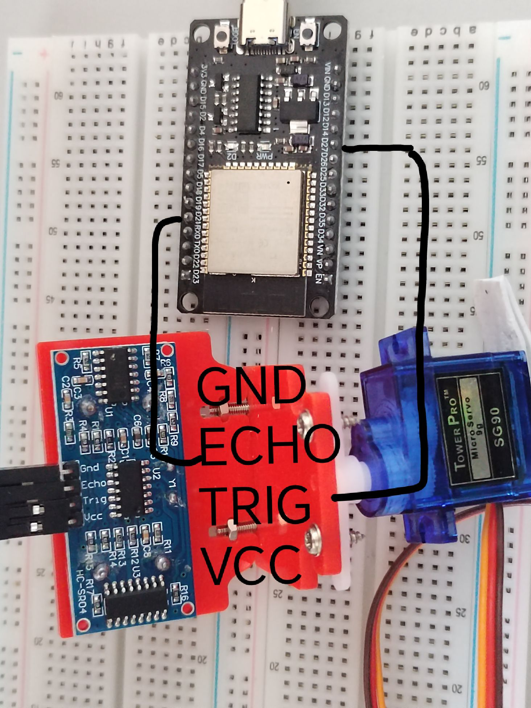

# ESP32Servo
>在ini里加入
```c
lib_deps = 
    madhephaestus/ESP32Servo@^0.12.0
```
## c创建对象
```c
#include <ESP32Servo.h>
Servo servo1; // 创建对象
```
## 设置舵机参数
```c
servo1.setPeriodHertz(50);   // 舵机控制周期为50hz，即一个周期1000/50=20ms
servo1.attach(4, 500, 2500); // 使用GPIO4作为舵机1信号引脚，占空比为500-2500us即 0.5-2.5ms
```
## 控制角度
```c
servo1.write(90.0);          // 设置90度
```
# 使用超声波
## 超声波传感器的引脚连接
```c
#define Trig 27 // 设定SR04连接的Arduino引脚
#define Echo 21
void setup()
{
  pinMode(Trig, OUTPUT); // 初始化舵机和超声波
  pinMode(Echo, INPUT);  // 要检测引脚上输入的脉冲宽度，需要先设置为输入状态
}
```

## 测距
```c
float get_distance(int angle)
{
  static double mtime;
  servo1.write(angle);     // 移动到指定角度
  delay(25);               // 稳定身形
  digitalWrite(Trig, LOW); // 测量距离
  delayMicroseconds(2);
  digitalWrite(Trig, HIGH);
  delayMicroseconds(10); // 产生一个10us的高脉冲去触发SR04
  digitalWrite(Trig, LOW);
  mtime = pulseIn(Echo, HIGH);                  // 检测脉冲宽度，注意返回值是微秒us
  float detect_distance = mtime / 58.0 / 100.0; // 计算出距离,输出的距离的单位是厘米cm
  Serial.printf("point(%d,%f)\n", angle, detect_distance);
  return detect_distance;
}
```
# 使用wifi
>在ini里加入
```c
board_microros_transport = wifi
```