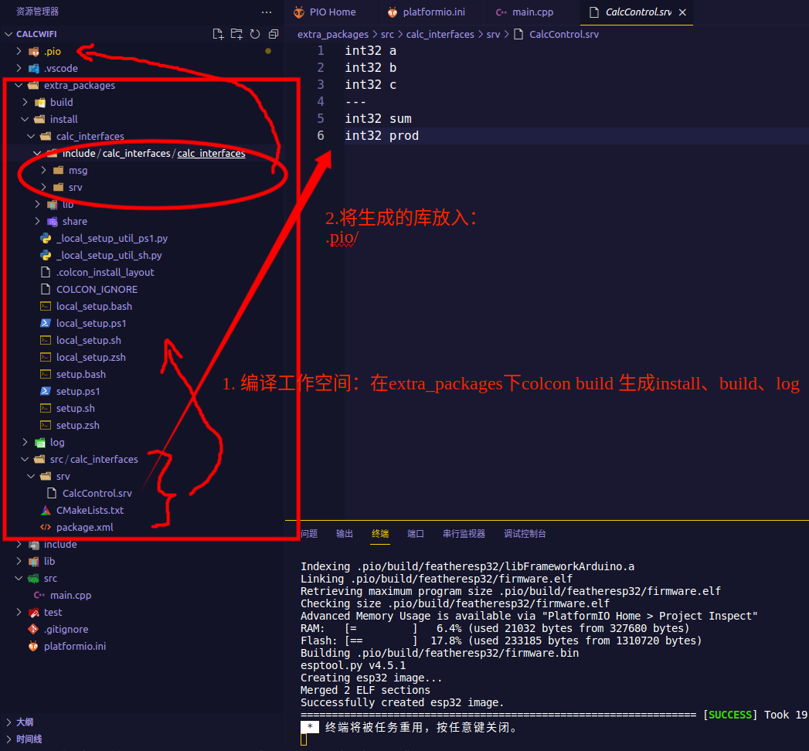

# wifi传递数据
```
board_microros_transport = wifi
lib_deps = 
    https://gitee.com/ohhuo/micro_ros_platformio.git
```
# 计算消息类型
## 🐞🐞🐞添加自定义接口
```
mkdir -p extra_packages/src
cd extra_packages/src 
ros2 pkg create calc_interfaces --build-type ament_cmake --dependencies rclcpp std_msgs rosidl_default_generators
```
1. 接着添加服务接口文件`extra_packages/calc_interfaces/srv/CalcControl.srv`并修改`CMakeLists.txt`
```txt
int32 a
int32 b
int32 c
---
int32 sum
int32 prod
```

✅✅✅放入.pio/libdeps/featheresp32/micro_ros_platformio/libmicroros文件夹

> `extra_packages/calc_interfaces/CMakeLists.txt`

```CMake
cmake_minimum_required(VERSION 3.8)
project(calc_interfaces)

find_package(rosidl_default_generators REQUIRED)

rosidl_generate_interfaces(${PROJECT_NAME}
  "srv/calcControl.srv"
 )

ament_package()

```

2. colcon build --packages-select calc_interfaces --packages-up-to calc_interfaces --cmake-clean-first
> ❌❌❌报错
```python
gy@gy-u22:~/ROS2_Coming/ESP32CalcWifi/CalcWifi/extra_packages$ colcon build
Starting >>> calc_interfaces
--- stderr: calc_interfaces                             
Traceback (most recent call last):
  File "/opt/ros/humble/share/rosidl_generator_py/cmake/../../../lib/rosidl_generator_py/rosidl_generator_py", line 8, in <module>
    from rosidl_generator_py import generate_py
ImportError: cannot import name 'generate_py'
gmake[2]: *** [calc_interfaces__py/CMakeFiles/calc_interfaces__py.dir/build.make:91：rosidl_generator_py/calc_interfaces/_calc_interfaces_s.ep.rosidl_typesupport_fastrtps_c.c] 错误 1
gmake[1]: *** [CMakeFiles/Makefile2:590：calc_interfaces__py/CMakeFiles/calc_interfaces__py.dir/all] 错误 2
gmake[1]: *** 正在等待未完成的任务....
gmake: *** [Makefile:146：all] 错误 2
---
Failed   <<< calc_interfaces [0.56s, exited with code 2]

Summary: 0 packages finished [0.84s]
  1 package failed: calc_interfaces
  1 package had stderr output: calc_interfaces
```
## 编译platform
3. 编译前需要删除.pio/libdeps/featheresp32/micro_ros_platformio/libmicroros文件夹

# 自定义消息类型
## 消息类型
1. 提供了一系列标准消息类型`ros2 interface package std_msgs`
2. 用于列出系统中所有可用的接口（包括消息（messages）、服务（services）和动作（actions））定义`ros2 interface list`

`ros2 interface show geometry_msgs/msg/Twist`
## 消息类型接口
包通常包含三个子文件夹，分别用于存放自定义消息、服务和行动接口类型，他们是msg、srv、action。
> 在你的CMakeLists.txt文件中，需要添加以下内容：
```CMake
# find_package(rosidl_default_generators REQUIRED)

# 添加下面的内容
rosidl_generate_interfaces(${PROJECT_NAME}
  "srv/CalcControl.srv"
  DEPENDENCIES std_msgs
)
```
> 将以下内容添加到你的 package.xml 文件中：

```
<buildtool_depend>rosidl_default_generators</buildtool_depend>
<exec_depend>rosidl_default_runtime</exec_depend>
<member_of_group>rosidl_interface_packages</member_of_group>
```
## 测试
```bash
gy@gy-u22:~/ROS2_Coming/ESP32CalcWifi/extra_packages$ colcon build --symlink-install
Starting >>> calc_interfaces
Finished <<< calc_interfaces [4.83s]                     

Summary: 1 package finished [5.10s]
gy@gy-u22:~/ROS2_Coming/ESP32CalcWifi/extra_packages$ ros2 interface show calc_interfaces/srv/CalcControl 
Unknown package 'calc_interfaces'
gy@gy-u22:~/ROS2_Coming/ESP32CalcWifi/extra_packages$ source install/setup.sh 
gy@gy-u22:~/ROS2_Coming/ESP32CalcWifi/extra_packages$ ros2 interface show calc_interfaces/srv/CalcControl 
int32 a
int32 b
int32 c
---
int32 sum
int32 prod
```
