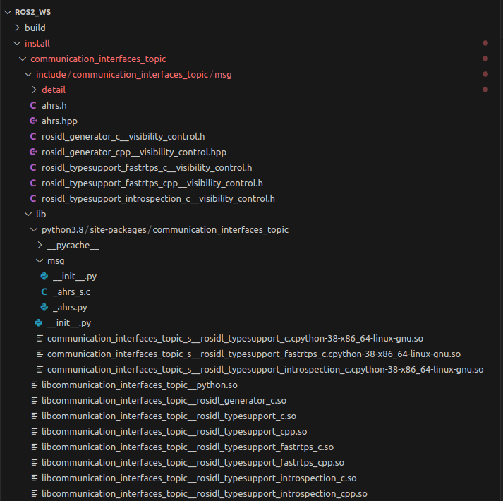
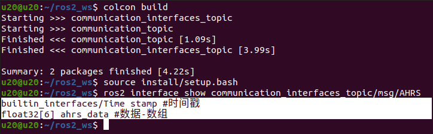
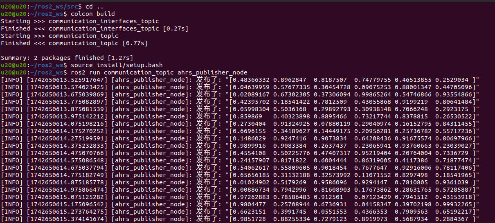
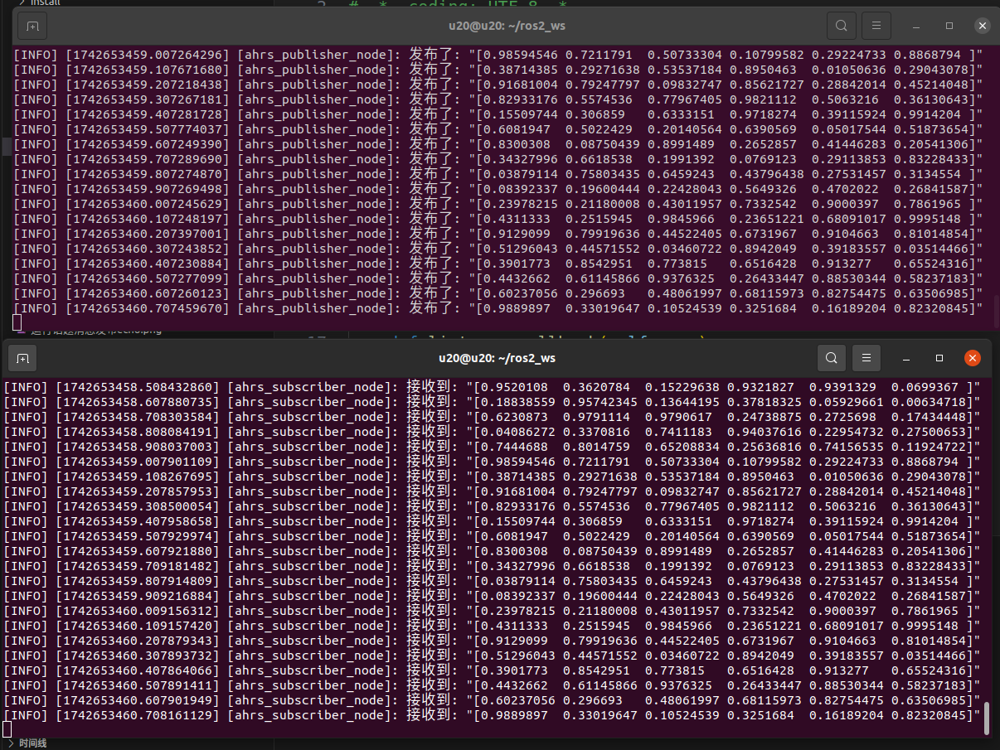
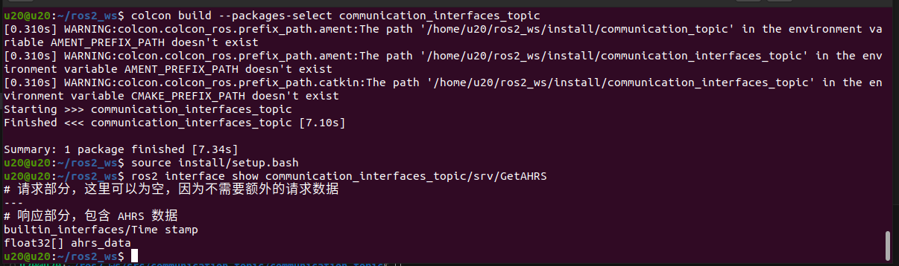
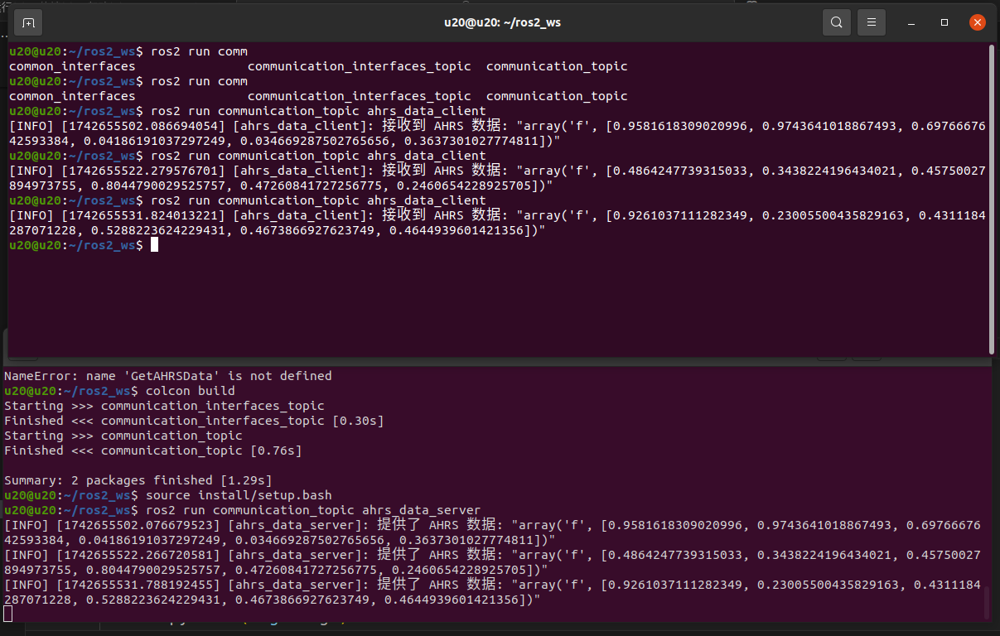
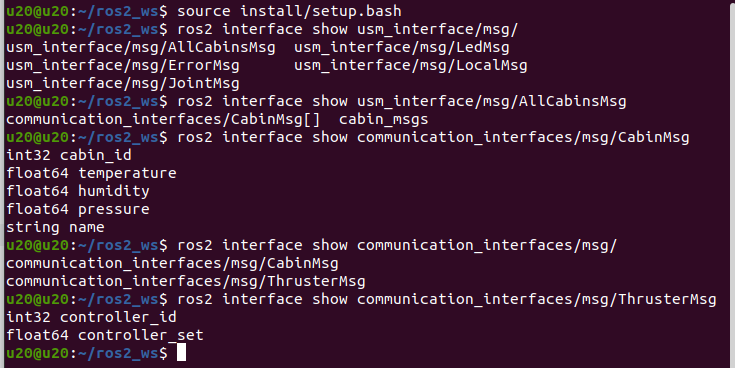

# 先创建自定义接口【❗❗❗注意：要使用cmake，python是不行的】
## 编写AHRS.msg
```
ros2 pkg create communication_interfaces_topic --build-type ament_cmake --dependencies rclpy std_msgs sensor_msgs builtin_interfaces rosidl_default_generators
```
1. builtin_interfaces：builtin_interfaces 是 ROS 2 提供的一个基础包，它定义了一些常用的内置消息类型，像时间（Time）、持续时间（Duration）等。很多其他消息类型都会依赖 builtin_interfaces 中定义的类型，因此在创建功能包时通常需要包含这个依赖。
2. rosidl_default_generators：rosidl_default_generators 是用于生成 ROS 2 接口代码的工具包。当你在功能包中定义了自定义的消息（.msg）、服务（.srv）或动作（.action）文件时，需要使用这个工具包来生成相应的代码，以便不同语言的节点能够正确地使用这些接口。
```bash
~/ros2_ws/src/communication_interfaces_topic$ tree
.
├── CMakeLists.txt
├── include
│   └── communication_interfaces_topic
├── msg
│   └── AHRS.msg
├── package.xml
└── src
```
☑️☑️☑️要求
1. 以小写字母 a-z 开头。
2. 仅包含小写字母 a-z、数字 0-9 和下划线 _。
3. 不能以双下划线 __ 作为连续字符。
4. 不能以下划线 _ 结尾。

```
builtin_interfaces/Time stamp #时间戳
float32[6] ahrs_data #数据-数组

```
定义 float32[] 时，没有对数组长度进行限制，意味着数组可以是任意长度。 float32[6] 表示固定长度为 6 的 float32 数组。
## 生成AHRS代码
1. 🔔🔔🔔在CMakeLists.txt添加，rosidl_generate_interfaces将.msg转为对应头文件
```
set(msg_files
  "msg/AHRS.msg"
)
rosidl_generate_interfaces(${PROJECT_NAME}
  ${msg_files}
  DEPENDENCIES builtin_interfaces
)
```
2. 🔔🔔🔔在package.xml添加member_of_group,声明这是一个包含消息接口的功能包
```
<member_of_group>rosidl_interface_packages</member_of_group>
```



# 创建消息[话题]发布功能包
```
ros2 pkg create communication_topic --build-type ament_python --dependencies rclpy std_msgs sensor_msgs communication_interfaces_topic
```
python功能包会有同名文件夹。
```bash
~/ros2_ws/src/communication_topic$ tree
.
├── communication_topic
│   └── __init__.py
├── package.xml
├── resource
│   └── communication_topic
├── setup.cfg
├── setup.py
└── test
    ├── test_copyright.py
    ├── test_flake8.py
    └── test_pep257.py
```
## 创建[src/communication_topic/communication_topic/AHRS_pub.py]

```python
#!/usr/bin/env python3
# -*- coding: UTF-8 -*-
import rclpy
from rclpy.node import Node
import numpy as np
from communication_interfaces_topic.msg import AHRS

class AHRSDataPublisher(Node):
    def __init__(self):
        super().__init__('ahrs_publisher_node')
        # 创建一个发布者，发布 AHRS 消息到 'ahrs_data' 话题，队列大小为 10
        self.publisher_ = self.create_publisher(AHRS, 
                                                'ahrs_data', 
                                                10)
        # 设置发布频率为 10Hz
        timer_period = 0.1  # seconds
        self.timer = self.create_timer(timer_period, self.timer_callback)

    def timer_callback(self):
        # 【获取数据】      生成 6 个 随机数
        ahrs_data = np.random.rand(6).tolist()


        # 【打包数据】      创建 AHRS 消息实例
        ahrs_data_msg = AHRS()
        # 设置消息的 ahrs_data 字段
        ahrs_data_msg.stamp = self.get_clock().now().to_msg()
        ahrs_data_msg.ahrs_data = ahrs_data
        # 【发布消息】
        self.publisher_.publish(ahrs_data_msg)
        # 记录日志信息
        self.get_logger().info('发布了: "%s"' % ahrs_data_msg.ahrs_data)

def main(args=None):
    # 初始化 ROS 2
    rclpy.init(args=args)
    # 创建发布者节点实例
    ahrs_publisher = AHRSDataPublisher()
    # 进入节点的主循环
    rclpy.spin(ahrs_publisher)
    # 销毁节点
    ahrs_publisher.destroy_node()
    # 关闭 ROS 2
    rclpy.shutdown()

if __name__ == '__main__':
    main()
```

## setup添加：节点 = 功能包.文件名:main
```
'ahrs_publisher_node = communication_topic.AHRS_pub:main',
```



# 服务
## 自定义服务接口【📐📐📐消息是msg、📌📌📌服务是srv】
```bash
~/ros2_ws/src/communication_interfaces_topic$ tree
.
├── CMakeLists.txt
├── include
│   └── communication_interfaces_topic
├── msg
│   ├── AHRS.msg
│   ├── Altitude.msg
│   ├── Depth.msg
│   ├── DVL.msg
│   ├── Pose.msg
│   └── Thrust.msg
├── package.xml
├── src
└── srv
    └── GetAHRS.srv
```
```
# 请求部分，这里可以为空，因为不需要额外的请求数据
---
# 响应部分，包含 AHRS 数据
builtin_interfaces/Time stamp
float32[] ahrs_data

```

## 创建名为`get_ahrs_data`的服务端口
AHRS_ser.py
```
self.srv = self.create_service(GetAHRSData, 'get_ahrs_data', self.get_ahrs_data_callback)
```


# 控制箱与🔌🔌🔌🔌🔌🔌🔌🔌🔌🔌🔌🔌🔌🔌🔌🔌🔌水下机器人
## 新建communication_interfaces功能包
```
ros2 pkg create communication_interfaces --build-type ament_cmake --dependencies std_msgs sensor_msgs builtin_interfaces rosidl_default_generators
```
### 构建CabinMsg.msg和ThrusterMsg.msg
```bash
~/ros2_ws/src/communication_interfaces$ tree
.
├── CMakeLists.txt
├── include
│   └── communication_interfaces
├── msg
│   ├── CabinMsg.msg
│   └── ThrusterMsg.msg
├── package.xml
└── src
```
### 🔔🔔🔔package.xml与CmakeList.txt添加配置
然后对这个功能包编译
```
colcon build --packages-select communication_interfaces
```

### 然后继续编写[在 ROS 里，一个包不能依赖它自身]
> JointMsg.msg
> AllCabinsMsg.msg
> LocalMsg.msg
> LedMsg.msg
> ErrorMsg.msg
> PoseMsg.msg
## 新建usm_interface功能包
```
ros2 pkg create usm_interface --build-type ament_cmake --dependencies std_msgs sensor_msgs builtin_interfaces rosidl_default_generators communication_interfaces
```
### 配置🔔🔔🔔
```
set(msg_files
  "msg/AllCabinsMsg.msg"
  "msg/JointMsg.msg"
  "msg/ErrorMsg.msg"
  "msg/LedMsg.msg"
  "msg/LocalMsg.msg"
)
rosidl_generate_interfaces(${PROJECT_NAME}
  ${msg_files}
  DEPENDENCIES communication_interfaces builtin_interfaces std_msgs
)
```
### 编译usm_interface
```
colcon build --packages-select usm_interface
```

# 创建usm包
```
ros2 pkg create usm_node --build-type ament_python --dependencies rclpy std_msgs sensor_msgs communication_interfaces usm_interface
```
