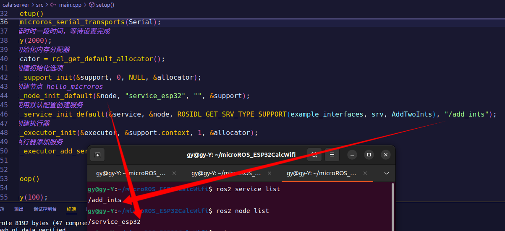
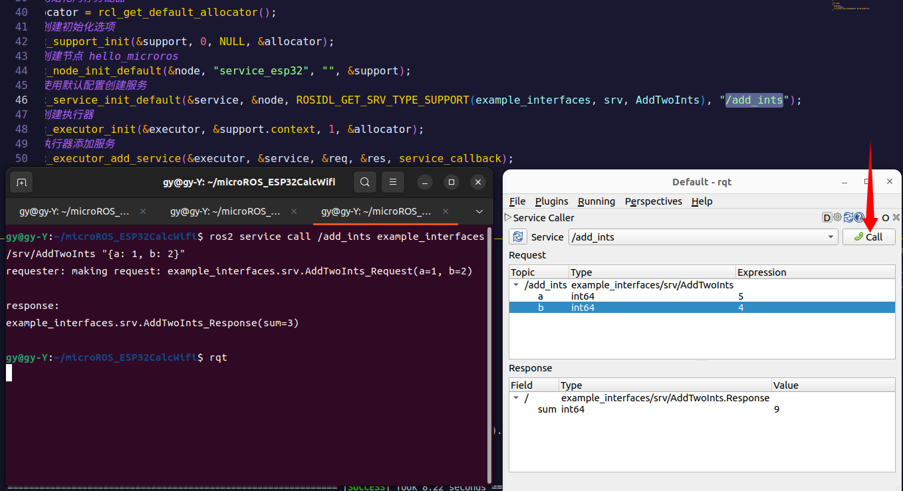
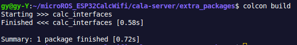
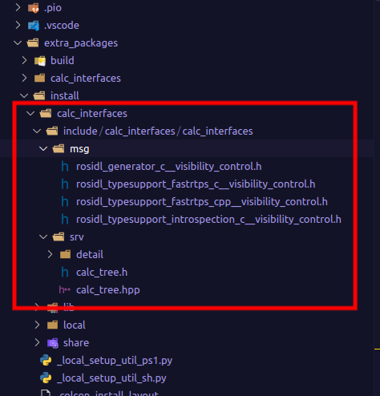
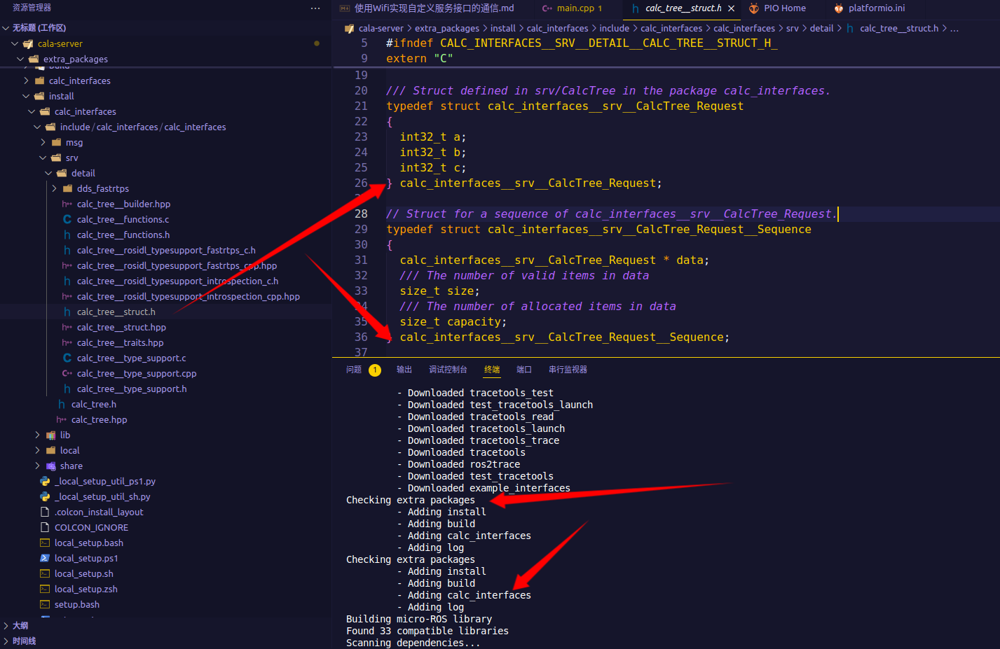

# ⚡通过串口实现两数相加
## 创建工程
在`platformio.ini`中，添加需要的<mark>microROS库</mark>
```
lib_deps = 
    https://gitee.com/ohhuo/micro_ros_platformio.git
```
## 添加服务接口
```
#include <example_interfaces/srv/add_two_ints.h>
```
## 测试
1. 启动虚拟串口
```
sudo docker run -it --rm -v /dev:/dev -v /dev/shm:/dev/shm --privileged --net=host microros/micro-ros-agent:$ROS_DISTRO serial --dev /dev/ttyUSB0 -v
```
2. 查看ROS中的节点
```
ros2 node list
ros2 service list
```


3. 使用rqt📞call一下
```
ros2 service call /add_ints example_interfaces/srv/AddTwoInts "{a: 1, b: 2}"
```


# ⚡⚡通过Wifi通信
在`platformio.ini`中，添加<mark>启动Wifi</mark>
```
board_microros_transport = wifi
lib_deps = 
    https://gitee.com/ohhuo/micro_ros_platformio.git
```
## 添加Wifi相关配置
```c
#include <WiFi.h>

  IPAddress agent_ip;
  agent_ip.fromString("192.168.111.36");
  // 设置wifi名称，密码，电脑IP,端口号
  set_microros_wifi_transports("glyz", "85856666", agent_ip, 8888);
```
## 测试
1. 启动虚拟串口<mark>udp4</mark>
```
sudo docker run -it --rm -v /dev:/dev -v /dev/shm:/dev/shm --privileged --net=host microros/micro-ros-agent:$ROS_DISTRO udp4 --port 8888 -v6
```
2. 使用`rqt/service call`
```
ros2 service call /add_ints example_interfaces/srv/AddTwoInts "{a: 1, b: 2}"
```
# ⚡⚡自定义服务接口
## 新建`extra_packages`并创建功能包`calc_interfaces`
```
ros2 pkg create calc_interfaces --dependencies rosidl_default_generators
```
## 新建`srv/CalcTree.srv`
```
int32 a
int32 b
int32 c
---
int32 sum
int32 prod
```
## 在`CMakeLists.txt`和`package.xml`添加如下内容：
```CMake
rosidl_generate_interfaces(${PROJECT_NAME}
  "srv/CalcTree.srv"
)
```
```xml
<member_of_group>rosidl_interface_packages</member_of_group>
```
## colcon build


## 删掉/microROS_ESP32CalcWifi/cala-server/.pio/libdeps/featheresp32/micro_ros_platformio/libmicroros

## 报错(编译不成功时，可能需要安装一下rosidl-default-generators)

```
sudo apt-get install ros-humbel-rosidl-default-generators

export CMAKE_PREFIX_PATH = $CMAKE_PREFIX_PATH:/opt/ros/humble/share/rosidl_default_generators/
```
# ⚡⚡⚡使用Wifi实现自定义服务接口的通信
## 更改回调函数
```c
  res_in->sum = req_in->a + req_in->b + req_in->c;
  res_in->prod = req_in->a + req_in->b + req_in->c;
```
## 测试
```
ros2 service call /calc_ints calc_interfaces/srv/CalcTree "{a: 1, b: 2, c: 2}"
```
## 报错(类型不对时，需要source一下)

```
The passed service type is invalid
```

```
/microROS_ESP32CalcWifi/cala-server/extra_packages$ source install/setup.bash

/microROS_ESP32CalcWifi/cala-server/extra_packages$ ros2 service call /calc_ints calc_interfaces/srv/CalcTree "{a: 1, b: 2, c: 2}"
requester: making request: calc_interfaces.srv.CalcTree_Request(a=1, b=2, c=2)

response:
calc_interfaces.srv.CalcTree_Response(sum=5, prod=4)

/microROS_ESP32CalcWifi/cala-server/extra_packages$ rqt
```
